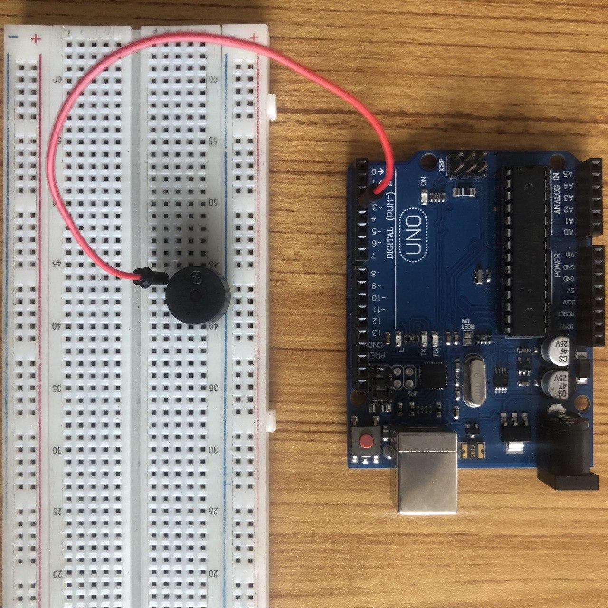
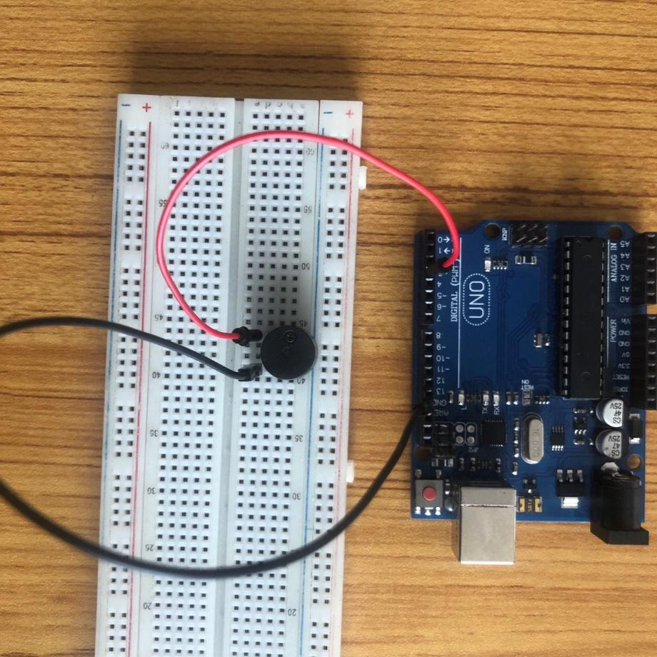
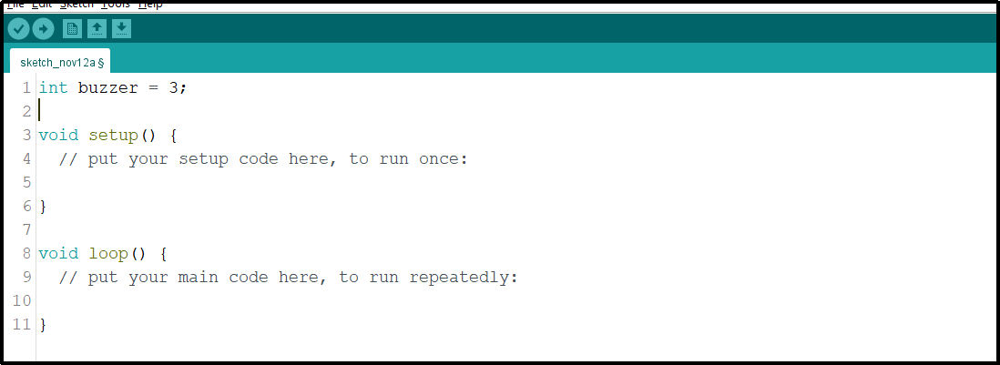
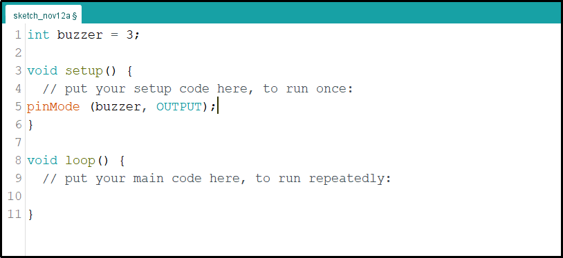
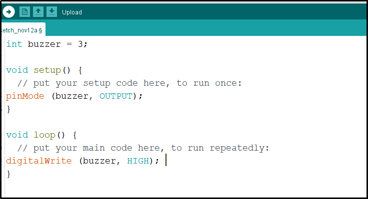

# Project 1: Buzzer Control With Arduino(On and OFF)

| **Description** | You will learn how to create a simple circuit using an Arduino microcontroller and a buzzer to produce a sound. |
| --------------- | --------------------------------------------------------------------------------------------------------------- |
| **Use case**    | Imagine you want to produce a sound using Arduino.                                                              |

## Components (Things You will need)

|  |  |  |  |  |
| ------------------------------------------ | --------------------------------------------------- | ----------------------------------------------------------- | ----------------------------------------------------- | ------------------------------------------------------ |

## Building the circuit

Things Needed:

- Arduino Uno = 1
- Arduino USB cable = 1
- Buzzer = 1
- Red jumper wires = 1
- Blue jumper wires = 1

## Mounting the component on the breadboard

**Step 1:** Take the breadboard, the white LED and insert it into the vertical connectors on the breadboard.

.

_**NB:** Make sure you identify where the positive pin (+) and the negative pin (-) is connected to on the breadboard. The longer pin of the Buzzer is the positive pin and the shorter one, the negative PIN_.

## WIRING THE CIRCUIT

### Things Needed:

- Red male-male-to-male jumper wires = 1
- Black male-to-male jumper wires = 1

**Step 2:** Connect one end of the red male-to-male jumper wire to the positive pin of the buzzer and the other end to digital pin 3 on the Arduino Uno board.

.

**Step 3:** Connect one end of the black male-to-male jumper to the negative pin of the black on the breadboard and the other end to GND on the Arduino UNO.

.

_make sure you connect the arduino usb blue cable to the Arduino board_.

.

_just as shown above, connect your USB cable to the Arduino board and to your laptop._

## PROGRAMMING

**Step 1:** Open your Arduino IDE. See how to set up here: [Getting Started](../../../../README.md#getting-started).

**Step 2:** Type `  int buzzer = 3;` before the void setup function.

.

**Step 3:** Type the following codes in the void setup function as shown below;

```
pinMode (buzzer, OUTPUT);
```

.

**Step 4:** Type the following codes in the void loop function as shown below;

```
Type digitalWrite (buzzer, HIGH);
```

.

**NB:** To turn off the buzzer, replace HIGH with LOW in the code. This change will stop sending a signal to the buzzer, turning it off.

**Step 5:** Save your code. _See the [Getting Started](../../../../README.md#getting-started) section_

**Step 6:** Select the arduino board and port _See the [Getting Started](../../../../README.md#getting-started) section:Selecting Arduino Board Type and Uploading your code_.

**Step 7:** Upload your code. _See the [Getting Started](../../../../README.md#getting-started) section:Selecting Arduino Board Type and Uploading your code_

## OBSERVATION

When the circuit is functioning, observe the buzzer emitting a beep sound as expected. This indicates that the buzzer is receiving the signal correctly from the Arduino and is operating as intended.

## CONCLUSION

The Buzzer Beep project offers learners hands-on experience in implementing a buzzer. It involves both wiring and coding to produce sounds based on the learner's preferences. This project serves as a stepping stone to understanding other output devices and sensors. It acts as an introductory experience for more intricate electronics projects, all while illustrating the concept of repetitive actions and sparking interest in practical electronic applications.
