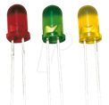
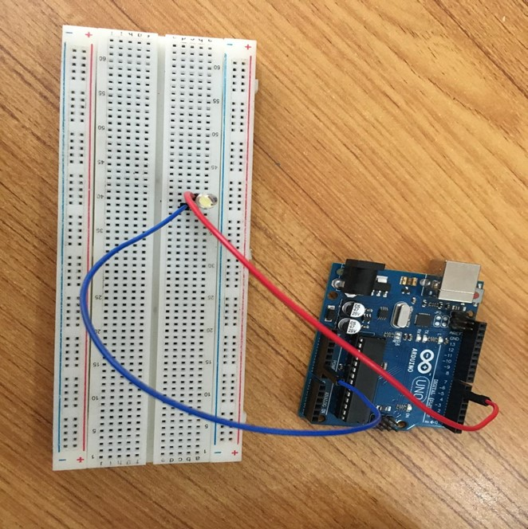

# Project 2: LED ON

| **Description** | LED ON is a simple project that guides you in turning on LEDs. |
|------------------|----------------------------------------------------------------|
| **Use case**     | This project finds utility in basic signaling setups. For instance, it could be applied in an easier and basic lighting system, where LEDs turning on together provide ample brightness when someone enters a room. |

## Components (Things You will need)

|  |  |  |  |
|-------------------------|-------------------------|-------------------------|-------------------------|

## Building the circuit

Things Needed:

- Arduino Uno = 1
- Arduino USB cable = 1
- White LED = 1
- Red LED = 1
- Red jumper wires = 1
- Blue jumper wires = 1

## Mounting the component on the breadboard

**Step 1:** Take the breadboard, the white LED and insert it into the vertical connectors on the breadboard.

.

_**NB:** Make sure you identify where the positive pin (+) and the negative pin (-) is connected to on the breadboard. The longer pin of the LED is the positive pin and the shorter one, the negative PIN_.

## WIRING THE CIRCUIT

### Things Needed:

- Red male-male-to-male jumper wires = 1
- Blue male-to-male jumper wires = 1

**Step 1:** Open your Arduino IDE. See how to set up here: [Getting Started](../../../../README.md#getting-started).

**Step 2:** Connect one end of red male-to-male jumper wire to the positive pin of the white LED on the breadboard and the other end to hole number 6 on the Arduino UNO.


**Step 3:** Connect one end of the blue male-to-male jumper to the negative pin of the white LED on the breadboard and the other end to GND on the Arduino UNO.
.

_make sure you connect the arduino usb use blue cable to the Arduino board_.

## PROGRAMMING

**Step 1:** Type ```C++ pinMode (6, OUTPUT);

.

**Step 2:** Type ```C++ digitalWrite (6, HIGH);

.

as shown in the picture above.

**NB:** pinMode will help the Arduino board to decide which port should be activated. The code below will turn off the light bulb.

**Step 3:** Save your code. _See the [Getting Started](../../../../README.md#getting-started) section_

**Step 4:** Select the arduino board and port _See the [Getting Started](../../../../README.md#getting-started) section:Selecting Arduino Board Type and Uploading your code_.

**Step 5:** Upload your code.

## CONCLUSION
In summary, this LED project presents a basic yet significant step in understanding parallel LED control. By simultaneously lighting up two LEDs, learners gain insight into simple circuit connections and programming synchronization. This project serves as a starting point for more complex configurations while highlighting the fundamental principle of coordinated electronic actions, setting the stage for broader exploration in electronics and automation.


