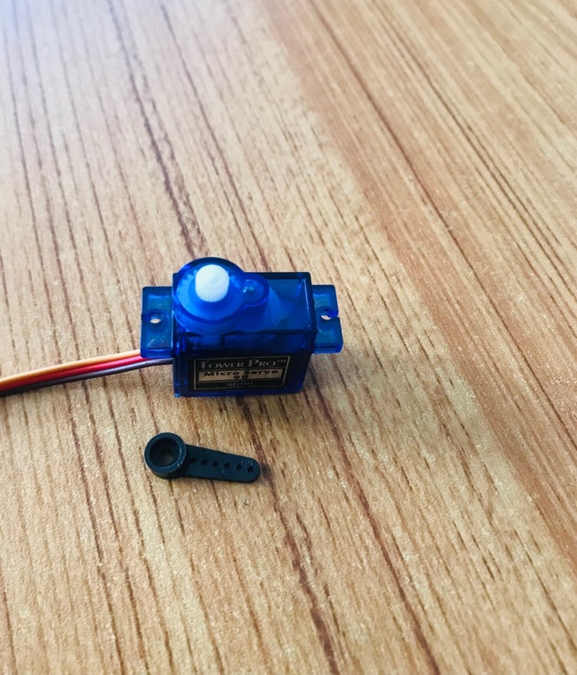
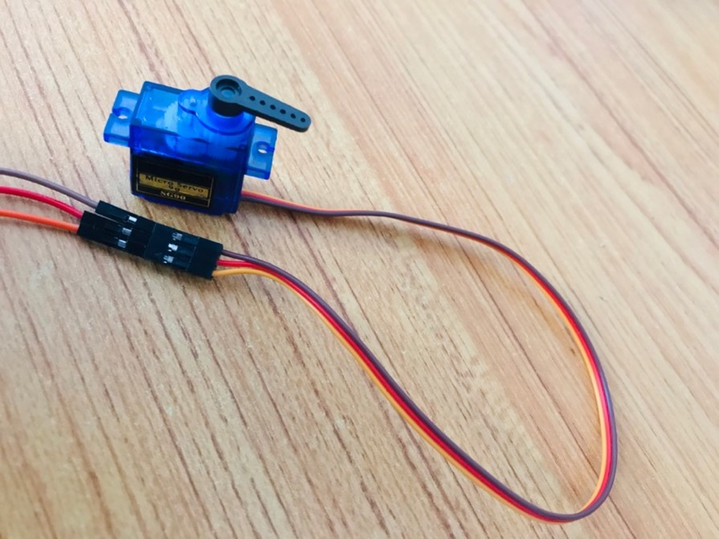
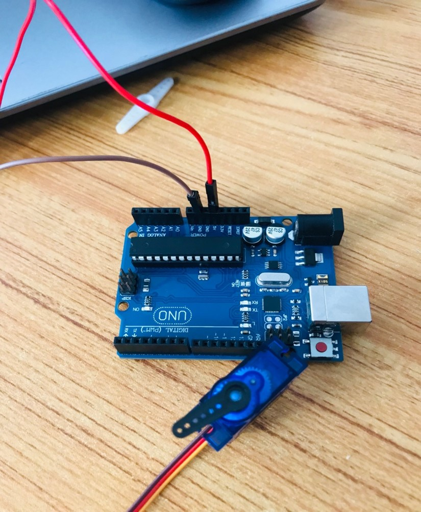
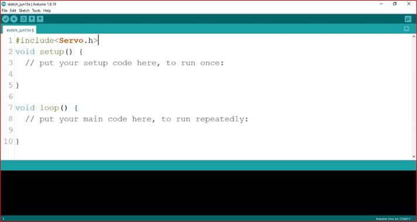
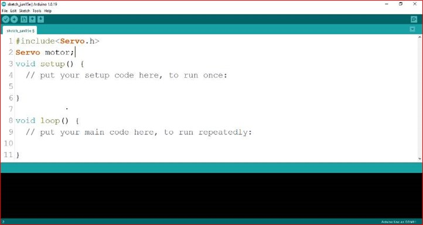
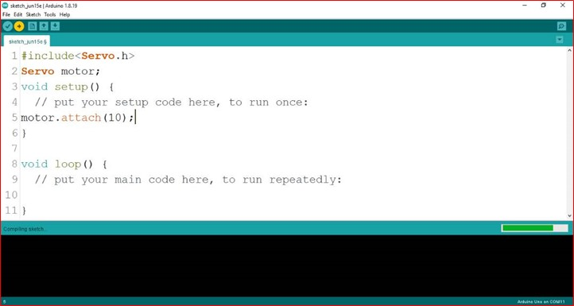

# Project 1: Car windshield wiper

| **Description** | This project demonstrates how to create a back-and-forth sweeping motion using a servo motor, similar to the movement of a car windshield wiper or a sweeping robot. This concept can also be applied in smart doors that open and close automatically. |
| --------------- | ------------------------------------------------------------------------------------------------------------------------------------------------------------------------------------------------------------------------------------------------------- |
| **Use case**    | Creating a smart Car windshield wiper                                                                                                                                                                                                                   |

opens by itself and closes by itself.
|

## Components (Things You will need)

|  |  |  |  |
| --------------------------------------------------- | ----------------------------------------------------------- | -------------------------------------------------- | ------------------------------------------------------ |

## Building the circuit

Things Needed:

- Arduino Uno = 1
- Arduino Uno = 1
- Arduino USB cable = 1
- Servo Motor = 1
- Servo Motor blade =1
- Brown Jumper Wire = 1
- Red Jumper Wire = 1
- Orange Jumper Wire = 1

## Mounting the component on the breadboard

**Step 1:** Attach the Servo Arm: Place the swing arm on the white tip of the servo motor and press down gently until it fits securely.

.

_**NB:** Make sure you identify where the positive pin (+) and the negative pin (-) is connected to on the breadboard. The longer pin of the LED is the positive pin and the shorter one, the negative PIN_.

## WIRING THE CIRCUIT

### Things Needed:

- Red male-male-to-male jumper wires = 1
- Brown male-to-male jumper wires = 1
- Yellow male-to-male jumper wires = 1

**Step 2:** Connect the male end of the red jumper wire to the female connector on the servo’s red wire.

.

**Step 3:** Connect the male end of the brown jumper wire to the female connector on the servo’s brown wire.

.

**Step 4:** Connect the male end of the orange jumper wire to the female connector on the servo’s orange wire.

.

**Step 5:** Connect the other end of the red jumper wire to the 5V pin on the Arduino Uno.

.

**Step 6:** Connect the other end of the brown jumper wire to gnd pin on the Arduino Uno.

.

**Step 7:** Connect the other end orange jumper wire to Digital pin 10 on the Arduino Uno.

.

_just as shown above, connect your USB cable to the Arduino board and to your laptop._

## PROGRAMMING

**Step 1:** Open your Arduino IDE. See how to set up here: [Getting Started](../../../../README.md#getting-started).

**Step 2:** Type ` #include <Servo.h>;` on line one before void Setup() function.

.

**Step 3:** Type ` Servo motor;` on line two before void Setup() function.

.

**Step 4:** Type `motor.attach(10);` inside the void Setup() function.

.

**Step 5:** Type

```
for (int i = 0; i <= 180; i++) {
motor.write (i);
delay (10);
}
for (int i = 180; i >= 0; i--) {
motor.write (i);
	delay (10).
}

```

inside the void loop() function.

.

\_**NB:**

- In this loop:
- The first for loop gradually moves the servo from 0° to 180°, creating an upward sweep.
- The second for loop moves the servo back from 180° to 0°, creating a downward sweep.

.

\_**NB:** Here, motor.write(90); sets the servo to 90 degrees. You can change the angle by adjusting the number (from 0 to 180) in parentheses, such as motor.write(180);

**Step 6:** Save your code. _See the [Getting Started](../../../../README.md#getting-started) section_

**Step 7:** Select the arduino board and port _See the [Getting Started](../../../../README.md#getting-started) section:Selecting Arduino Board Type and Uploading your code_.

**Step 8:** Upload your code. _See the [Getting Started](../../../../README.md#getting-started) section:Selecting Arduino Board Type and Uploading your code_

## CONCLUSION

This project teaches you the basics of controlling a servo motor, which is essential in many electronics and robotics applications. By adjusting the rotation angle, you can experiment with different movements, exploring how targeted motion can be used in various devices.
