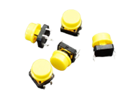

# Project 1:LED Control with Arduino and Push Button

| **Description** | You will learn how to create a simple circuit using an Arduino microcontroller and a push button to make LED blink.                                                                                            |
| --------------- | -------------------------------------------------------------------------------------------------------------------------------------------------------------------------------------------------------------- |
| **Use case**    | Imagine you want to create an interactive lighting system for your living room using Arduino and push buttons. You want to control the ambiance by turning on specific lights with a simple press of a button. |

## Components (Things You will need)

|  |  |  |  |  |  |
| ---------------------------------------- | --------------------------------------------------- | ----------------------------------------------------------- | ----------------------------------------------------- | ------------------------------------------------------ | ------------------------------------------------------- |

## Building the circuit

Things Needed:

- Arduino Uno = 1
- Arduino USB cable = 1
- Resistor = 1
- Push button = 1
- Red LED = 1
- Blue jumper wire= 1
- Yellow jumper wire= 1
- Black jumper wire= 1
- Red jumper wire= 1

## Mounting the component on the breadboard

**Step 1:** Connect the push button on the breadboard but make sure the two pair of the pins are connected on each side of the bridge.
.

**step 2:** Inset two (2) LED s on the breadboard as shown in the picture below.
.

## WIRING THE CIRCUIT

### Things Needed:

- Blue jumper wire= 1
- Yellow jumper wire= 1
- Black jumper wire= 1
- Red jumper wire= 1
- White jumper wire= 1
- Green jumper wire= 1

**step 1:** Connect Yellow male-to-male jumper wire from one Pin of the Push Button as a negative to power GND (Ground) on the Arduino UNO.
.

**step 2:** connect Blue male-to-male jumper wire from the other Pin of the push button (not connected to GND) to any digital pin on the Arduino UNO. Let's use digital pin 13 in this tutorial.
.

**step 3:** Connect Black male-to-male jumper wire from the shorter pin of the first LED as a negative to power GND (Ground) on the Arduino UNO.
.

**step 4:** Connect Red male-to-male jumper wire from the longer pin of the first LED as a positive to digital pin 9 on the Arduino UNO.
.

**step 5:** Connect White male-to-male jumper wire from the shorter pin of the second LED as a negative to power GND (Ground) on the Arduino UNO.
.

**step 6:** Connect Green male-to-male jumper wire from the longer pin of the second LED as a positive to digital pin 7 on the Arduino UNO.
.

## PROGRAMMING

**Step 1:** Open your Arduino IDE. See how to set up here: [Getting Started](../../../../README.md#getting-started).

**Step 2:** Type the following codes before the void setup function.

```
const int ledPin1 = 13;
const int ledPin2 = 12;
const int buttonPin = 2;
bool isBlinking = false; 
```

.

**Step 3:** After the void setup ()within the curly brackets type the following codes.

```
pinMode (ledPin1, OUTPUT);
pinMode (ledPin2, OUTPUT);
pinMode (buttonPin, INPUT_PULLUP);
```

.

**Step 4:** : After the (void loop ()) within the curly brackets type

```
if (digitalRead(buttonPin) == LOW &&  !isBlinking) {
 isBlinking = true;
 while (digitalRead(buttonPin) == LOW) {
 digitalWrite (ledPin1, HIGH);
 digitalWrite (ledPin2, HIGH);
delay (500);

digitalWrite (ledPin1, LOW);
digitalWrite (ledPin2, LOW);
delay (500);
 }
 isBlinking = false;
  }

```

.

## Uploading the code

**Step 1:** Save your code. _See the [Getting Started](../../../../README.md#getting-started) section_

**Step 2:** Select the arduino board and port _See the [Getting Started](../../../../README.md#getting-started) section:Selecting Arduino Board Type and Uploading your code_.

**Step 3:** Upload your code. \_See the [Getting Started](../../../../README.md#getting-started) section:Selecting Arduino Board Type and Uploading your code

## CONCLUSION

If you encounter any problems when trying to upload your code to the board, run through your code again to check for any errors or missing lines of code. If you did not encounter any problems and the program ran as expected, Congratulations on a job well done.
